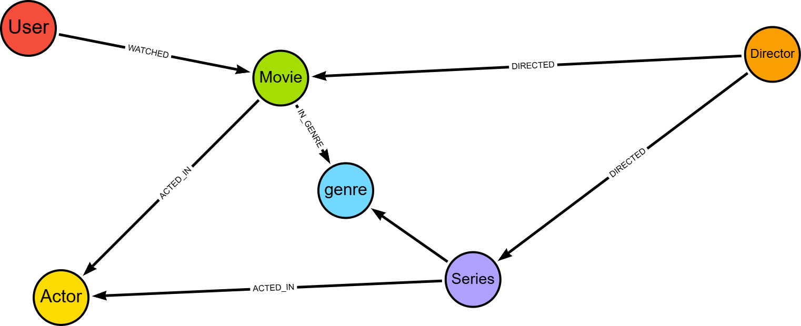

# 🎬 Streaming Knowledge Graph com Neo4j

Projeto desenvolvido para modelagem de um banco de dados orientado a grafos para um serviço de streaming de filmes e séries utilizando **Neo4j** e **Cypher**.

O objetivo é explorar relacionamentos entre usuários, conteúdos, gêneros, atores e diretores para possibilitar mecanismos avançados de recomendação.

---

## 📷 Modelo do Grafo



---

## 📋 Requisitos Atendidos

### Entidades (Nós)

- User
- Movie
- Series
- Genre
- Actor
- Director

### Relacionamentos

- `WATCHED` (com propriedade `rating`)
- `ACTED_IN`
- `DIRECTED`
- `IN_GENRE`

---

## 🏗️ Estrutura do Modelo

```text
(:User)
   |
   | WATCHED {rating}
   v
(:Movie) -----------------[:IN_GENRE]--------------> (:Genre)
    |                                             ^
    |                                             |
    | ACTED_IN                                    |
    v                                             |
 (:Actor)                                         |
                                                  |
(:Series) ----------------[:IN_GENRE]-------------+
    |
    | ACTED_IN
    v
 (:Actor)

(:Director)-[:DIRECTED]->(:Movie)

(:Director)-[:DIRECTED]->(:Series)
```

---

## 🔵 Nós

### User

```json
{
  "id": 1,
  "name": "Ana"
}
```

### Movie

```json
{
  "id": 1,
  "title": "Inception",
  "year": 2010
}
```

### Series

```json
{
  "id": 1,
  "title": "Breaking Bad",
  "year": 2008
}
```

### Genre

```json
{
  "id": 1,
  "name": "Sci-Fi"
}
```

### Actor

```json
{
  "id": 1,
  "name": "Leonardo DiCaprio"
}
```

### Director

```json
{
  "id": 1,
  "name": "Christopher Nolan"
}
```

---

## 🔗 Relacionamentos

### WATCHED

Representa o conteúdo assistido pelo usuário e sua avaliação.

```text
(:User)-[:WATCHED {rating:5}]->(:Movie)
```

Exemplo:

```text
(Ana)-[:WATCHED {rating:5}]->(Inception)
```

---

### ACTED_IN

Relaciona atores aos conteúdos.

```text
(:Actor)-[:ACTED_IN]->(:Movie)
(:Actor)-[:ACTED_IN]->(:Series)
```

---

### DIRECTED

Relaciona diretores aos conteúdos.

```text
(:Director)-[:DIRECTED]->(:Movie)
(:Director)-[:DIRECTED]->(:Series)
```

---

### IN_GENRE

Relaciona conteúdos aos seus gêneros.

```text
(:Movie)-[:IN_GENRE]->(:Genre)
(:Series)-[:IN_GENRE]->(:Genre)
```

---

## 🔒 Constraints

Para garantir integridade e unicidade dos dados:

```cypher
CREATE CONSTRAINT user_id_unique IF NOT EXISTS
FOR (u:User)
REQUIRE u.id IS UNIQUE;

CREATE CONSTRAINT movie_id_unique IF NOT EXISTS
FOR (m:Movie)
REQUIRE m.id IS UNIQUE;

CREATE CONSTRAINT series_id_unique IF NOT EXISTS
FOR (s:Series)
REQUIRE s.id IS UNIQUE;

CREATE CONSTRAINT genre_id_unique IF NOT EXISTS
FOR (g:Genre)
REQUIRE g.id IS UNIQUE;

CREATE CONSTRAINT actor_id_unique IF NOT EXISTS
FOR (a:Actor)
REQUIRE a.id IS UNIQUE;

CREATE CONSTRAINT director_id_unique IF NOT EXISTS
FOR (d:Director)
REQUIRE d.id IS UNIQUE;
```

---

## 📊 Base de Dados Populada

O banco foi populado com:

| Tipo | Quantidade |
|--------|---------|
| Usuários | 10 |
| Filmes | 5 |
| Séries | 5 |
| Gêneros | 5 |
| Atores | 5 |
| Diretores | 5 |

Totalizando dezenas de relacionamentos entre usuários e conteúdos para simular um ambiente real de streaming.

---

## 🎯 Exemplo de Recomendação

A consulta abaixo recomenda conteúdos para um usuário com base em outros usuários que possuem histórico semelhante:

```cypher
MATCH (u:User {name:'Ana'})-[:WATCHED]->(c1)
MATCH (other:User)-[:WATCHED]->(c1)
MATCH (other)-[:WATCHED]->(rec)
WHERE other <> u
  AND NOT EXISTS {
      MATCH (u)-[:WATCHED]->(rec)
  }
RETURN rec.title AS Recomendacao,
       COUNT(*) AS Similaridade
ORDER BY Similar*dade DESC;
```

---

## 🚀 Tecnolo*ias Utilizadas

- Neo4j
- Cypher Q*ery Language
- Graph Database
- Kn*wledge Graph

---

## 📚 Objetivo
*Demonstrar como bancos de dados em*grafo podem modelar relacionamento* complexos de forma natural, permi*indo consultas avanç*das e sistemas de recomendação mai* eficientes para plataformas de st*eaming.

---

### Autor

**Anderso* dos Santos Barbosa**

Projeto aca*êmico desenvolvido para estudo de *odelagem de grafos utilizando Neo4*.
